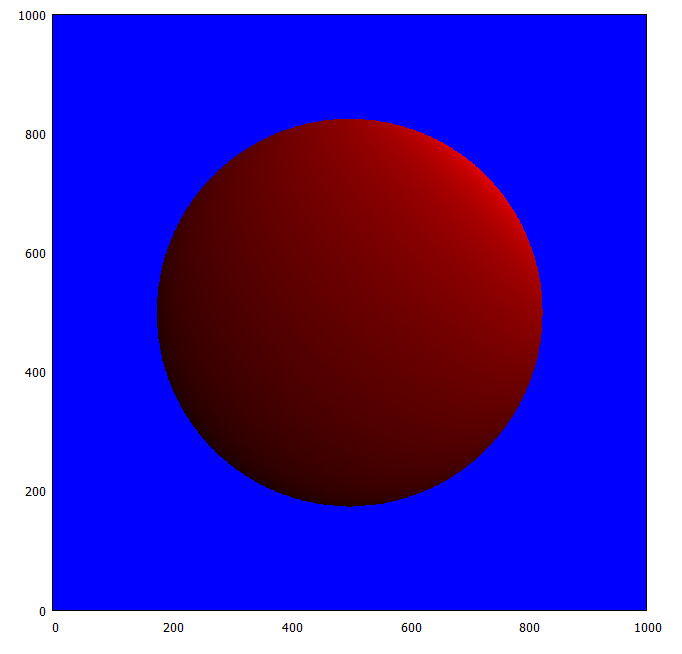

# README #

This project generates a sphere given an observer location, window size, light source location, and sphere center and radius.

It outputs a file pottable with the following gnuplot command:
plot "sphere.plot" with rgbimage

